# Outsourcing - Quick Reference Guide

## 🚀 Quick Access

**Where to find Outsourcing:**

```
Manufacturing Sidebar → Outsourcing 🚚
```

**URL**: `/outsourcing`

---

## 📍 Navigation Change

### ❌ Old Location (REMOVED)
```
Manufacturing Dashboard → Outsourcing Tab (was tab #7)
```

### ✅ New Location
```
Manufacturing Sidebar → Outsourcing (dedicated page)
```

---

## 🎯 What You Can Do

### 📦 Outsource Orders Tab

View and manage all outsourced work:

| Feature | Description |
|---------|-------------|
| **Order Tracking** | View all orders sent to external vendors |
| **Status Monitoring** | Track progress (in_progress, completed, delayed) |
| **Challan References** | Outward and inward challan tracking |
| **Quality Ratings** | View vendor quality scores |
| **Expected Delivery** | Monitor expected vs. actual return dates |

### 🏢 Vendors Tab

Manage external vendors:

| Feature | Description |
|---------|-------------|
| **Vendor List** | All registered vendors with contact details |
| **Specializations** | View vendor capabilities (Embroidery, Stitching, Printing) |
| **Performance Metrics** | Success rates and delivery times |
| **Quick Actions** | View details or create new order |
| **Add New Vendors** | Register new external vendors |

---

## 🔥 Quick Actions

From the Outsourcing Dashboard, you can quickly access:

```
┌─────────────────────────────────────────┐
│  Manage Vendors                         │ → /outsourcing/vendors
├─────────────────────────────────────────┤
│  Create Outsource Order                 │ → /outsourcing/create-order
├─────────────────────────────────────────┤
│  Vendor Performance                     │ → /outsourcing/performance
├─────────────────────────────────────────┤
│  Quality Reports                        │ → /outsourcing/quality
├─────────────────────────────────────────┤
│  Outsource Reports                      │ → /outsourcing/reports
├─────────────────────────────────────────┤
│  Export Reports                         │ → /outsourcing/reports/export
└─────────────────────────────────────────┘
```

---

## 📊 Dashboard Overview

### Stats Cards

- **Total Challans**: All outward challans sent to vendors
- **Open Challans**: Challans currently with vendors (not returned)

### Orders Table Columns

1. **Order No.** - Unique outsource order number (e.g., OUT-2024-001)
2. **Vendor Name** - External vendor handling the work
3. **Product/Service** - Type of work (embroidery, stitching, printing)
4. **Quantity** - Number of items sent
5. **Order Date** - When materials were sent
6. **Expected Return** - Expected delivery date
7. **Actual Return** - Actual delivery date (if completed)
8. **Status** - Current status with color coding:
   - 🟢 **Completed** - Work finished and returned
   - 🟡 **In Progress** - Currently with vendor
   - 🔴 **Delayed** - Overdue
9. **Progress** - Visual progress bar (0-100%)
10. **Outward Challan** - Challan number for outgoing materials
11. **Inward Challan** - Challan number for returned work
12. **Quality Rating** - Vendor quality score (0-5 stars)
13. **Actions** - View details, Edit, Track

### Vendors Table Columns

1. **Vendor Name** - Registered vendor name
2. **Contact Person** - Primary contact
3. **Phone** - Contact number
4. **Email** - Email address
5. **Specialization** - Vendor capabilities
6. **Active Orders** - Current orders with vendor
7. **Success Rate** - Historical performance (%)
8. **Avg. Delivery Time** - Average turnaround (days)
9. **Rating** - Overall rating (0-5 stars)
10. **Actions** - View details, Create order

---

## 🔄 Typical Workflow

### Creating an Outsource Order

```mermaid
graph LR
    A[Outsourcing Dashboard] --> B[Click 'Create Order']
    B --> C[Select Vendor]
    C --> D[Enter Order Details]
    D --> E[Create Outward Challan]
    E --> F[Send Materials]
    F --> G[Track Progress]
    G --> H[Receive Inward Challan]
    H --> I[Quality Check]
    I --> J[Complete Order]
```



**Steps:**

1. **Navigate**: Manufacturing Sidebar → Outsourcing
2. **Create**: Click "Create Outsource Order" button
3. **Select Vendor**: Choose from registered vendors
4. **Order Details**:
   - Production order reference
   - Stage to outsource (embroidery, printing, washing)
   - Quantity
   - Expected delivery date
   - Special instructions
5. **Materials**: Create outward challan for materials sent
6. **Track**: Monitor progress in Orders tab
7. **Receive**: Create inward challan when work returns
8. **Quality**: Rate vendor performance
9. **Complete**: Mark order as completed

---

## 🎨 Visual Indicators

### Status Colors

| Status | Badge Color | Meaning |
|--------|-------------|---------|
| **In Progress** | 🟡 Yellow | Work currently with vendor |
| **Completed** | 🟢 Green | Work finished and returned |
| **Delayed** | 🔴 Red | Past expected delivery date |

### Progress Bars

- **0-33%** - Early stage (just sent)
- **34-66%** - Mid-stage (in progress)
- **67-99%** - Near completion
- **100%** - Completed

### Quality Ratings

- ⭐⭐⭐⭐⭐ (5.0) - Excellent
- ⭐⭐⭐⭐ (4.0-4.9) - Very Good
- ⭐⭐⭐ (3.0-3.9) - Good
- ⭐⭐ (2.0-2.9) - Fair
- ⭐ (1.0-1.9) - Poor

---

## 🔗 Related Pages

### From Outsourcing Dashboard

- **Outward Challans** → Create and manage challans for materials sent to vendors
- **Inward Challans** → Manage challans for work returned from vendors
- **Vendor Tracking** → Real-time tracking of all vendor activities
- **Vendor Management** → Full CRUD operations for vendors

### From Manufacturing Section

- **Production Orders** → Orders that may need outsourcing
- **Production Tracking** → Monitor orders being outsourced
- **Quality Control** → Quality checks for returned work
- **Material Requests** → Materials needed for outsourced work

---

## ❓ Common Questions

### Q: Where did the Outsourcing tab go?

**A**: It's now a dedicated page! Click "Outsourcing" in the Manufacturing sidebar for the full dashboard.

### Q: Is the functionality different?

**A**: No, all functionality is preserved. You now have MORE features with a dedicated dashboard instead of a limited tab.

### Q: Can I still scan QR codes for outsourcing?

**A**: Yes! The QR Code Scanner tab is still available in the Manufacturing Dashboard (now tab #7).

### Q: How do I create an outward challan?

**A**: From Outsourcing Dashboard, click "Create Order" → Fill details → Outward challan is auto-created.

### Q: How do I track vendor performance?

**A**: Click "Vendor Performance" in Quick Actions or view the Vendors tab for success rates and ratings.

### Q: Can I add new vendors?

**A**: Yes! Go to Vendors tab → Click "Add New Vendor" → Enter vendor details.

---

## 💡 Pro Tips

1. **Use Filters**: Filter orders by status to quickly find delayed or in-progress work
2. **Track by Vendor**: Click vendor name to see all their orders
3. **Set Reminders**: Check expected delivery dates regularly
4. **Rate Quality**: Always rate vendor work to track performance
5. **Use Challans**: Proper challan management ensures traceability
6. **Monitor Stats**: Dashboard stats give quick overview
7. **Export Reports**: Use export feature for analysis and records

---

## 🎯 Key Benefits

✅ **Dedicated Space** - Full page for outsourcing operations  
✅ **Better Organization** - Separate tabs for Orders and Vendors  
✅ **Quick Access** - Always visible in sidebar  
✅ **More Features** - Full dashboard instead of limited tab  
✅ **Easier Management** - All outsourcing in one place  

---

## 📱 Mobile Access

The Outsourcing Dashboard is responsive and works on mobile devices:

- Tables scroll horizontally on small screens
- Touch-friendly buttons and actions
- Collapsible sections for better mobile UX
- Quick actions accessible from top

---

## 🆘 Need Help?

**Can't find Outsourcing?**
- Check if you're logged in as Manufacturing department
- Look in the left sidebar under Manufacturing section
- Scroll down if sidebar is collapsed

**Dashboard not loading?**
- Check network connection
- Refresh the page
- Clear browser cache if needed
- Contact admin if issue persists

**Missing vendors or orders?**
- Verify you have correct permissions
- Check if data is entered in the system
- Try refreshing the dashboard

---

**Quick Start:** Manufacturing Sidebar → Outsourcing → Start creating orders! 🚀